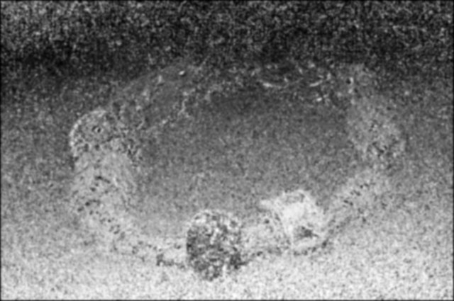

# Focus stacking and depth synthesis

This repo contains some experiments about focus stacking, i.e.
synthesis of in-focus areas of different images.

Simultaneously, a depth map of the scene is reconstructed by
taking advantage of a priori knowledge of the images taken,
such as focal distance of each image.

## Code

Open the [`focus-stacking.ipynb`](focus-stacking.ipynb) notebook to start.

## Example images

First image of the sequence:

Depth reconstruction from defocus (using all images):

Stacked/fused images:

